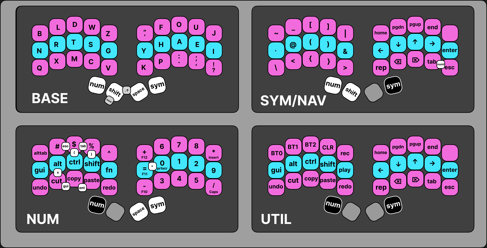

# Anachron ZMK Keyboard Layout ⌨️⌛

**anachronism (adj.)** /əˈnæk·rəˌnɪz·əm/ : a person or a thing that is
chronologically out of place; a chronological inconsistency

_Designed by @mkkaufmann and @theol0403. Inspired by urob, callum, seniply,
t-34, phnoty, keymapdb_.

WIP (Jun 6, 2023)

## Introduction

Anachron is a keyboard layout designed for 34-key keyboards, implemented with
ZMK. It builds from the design of existing layouts and aims to provide a fast,
intuitive, and ergonomic typing experience. It is similar to trilayer-based
layouts such as callum or seniply, but provides a unique layer design and takes
advantage of several ZMK features.

## Features

- intuitive and logical consistency of the trilayer
- timer-free callum mods, accelerated by anachron combos
- one handed shortcuts and navigation
- one handed mods, designed for mouse usage
- dedicated number pad
- caps word and smart numbers that turn off when done
- more intuitive shift-actions
- clean keymap using helper macros from
  [zmk-nodefree-config](https://github.com/urob/zmk-nodefree-config)
- various misc features

## Guiding Principles

**Dependable timing matters**

- no hesitation
- no slowing down
- small timing matters
- play at full speed as if regular keyboard
- this means no timers on the base layer or thumb keys

**Muscle memory needs simple and consistent**

- there should only be one way to do something, and it should be logical
- no matter the layer, the same muscle memory should try to achieve the same
  thing
- for example there should be one motion to get modifiers, and one motion to get
  arrows, and the same motion combined should get you modded arrows

**Sometimes, you don't have both hands on the keyboard**

- when you use the mouse with your right hand, shortcuts should still be
  accessible with the left
- if you are using your computer while doing other things on the desk, you
  should be able to access navigation and other layers with one hand

**Fancy features must be intuitive**

- Special features should feel like they belong, and should be easy to use, or
  else they will not be used

**Edge cases are important**

- great care should be taken to ensure that every combination of timing and
  keypresses results in natural behavior, regardless of implementation cost

## Details

**Layer Design**

- left thumb gives you symbols on left hand, right thumb gives you nav on right
  hand, regardless of layer
- left thumb gives you numbers on right hand, right thumb gives you symbols on
  left hand

**Anachron Combos**

- callum style layers, but with combos to speed them up
- mash them together, release with intuitive behavior

**Sticky Mods**

- mods are sticky, but are lazy, have a fast timeout, are held while the key is
  pressed, and are not sticky on hold

**Caps Word**

Double-tapping shift results in caps word.

**Smart Numbers**

Double-tapping number row results in smart numbers.

**Home Row Mods**

Home row mods are against the design principles, but can be intuitively enabled
by uncommenting lines

**Space Shift**

**Numpad combos**

- used for left hand nav
- used for math

**Verical SFB Combos**

- vertical combos are used to mash SFBs
